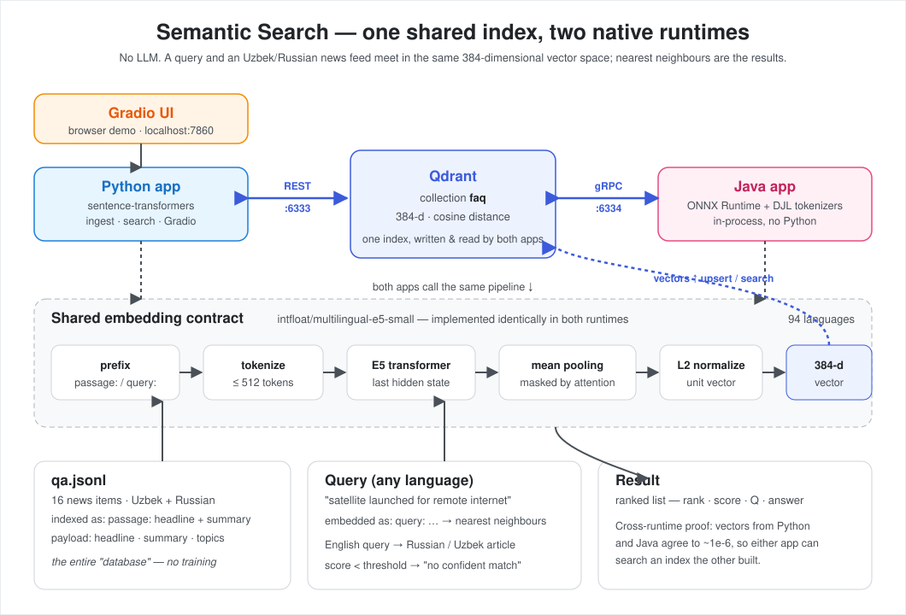

# Cross-lingual Semantic Search — Python + Java, one shared index

Search a small **Uzbek + Russian news feed** in *any* language. There's **no LLM** — a
query is matched to articles by meaning, so an English query finds the relevant Russian or
Uzbek article, and vice versa.

The same engine is built **twice** — a pure-Python app and a pure-Java app — and both read
and write the **same** Qdrant index. An index built by one is searchable by the other; that
cross-runtime agreement is the whole point.



## Quick start

```bash
docker compose build                     # build the (small) app image
docker compose run --rm model-download   # one-time: fetch the ~2.3 GB model into a cached volume
docker compose up                        # start — Qdrant + auto-ingest + Gradio UI
```

Then open the **Gradio UI at http://localhost:7860**. Stop with `docker compose down`.

The slow part — the ~2.3 GB model download — is a **separate one-time step** that fills a
cached volume, so `docker compose up` itself starts in seconds and never waits on a download.
Run `model-download` ahead of time (e.g. before a demo); it persists across restarts. If you
skip it, `up` still works — the ingest container just downloads the model on its first run.

## Run the apps natively

Start just the database, then run either app against it:

```bash
docker compose up -d qdrant
```

**Python**
```bash
cd python && pip install -r requirements.txt
python -m ragapp.ingest                                       # index qa.jsonl
python -m ragapp.search "satellite launched for remote internet"
python -m ragapp.app                                          # or the Gradio UI
```

**Java**
```bash
cd java && ./download-model.sh && mvn -q compile
mvn -q exec:java -Dexec.mainClass=com.example.rag.Ingest
mvn -q exec:java -Dexec.mainClass=com.example.rag.Search -Dexec.args="satellite launched for remote internet"
```

Search flags: `--limit` (default 3) and `--threshold` (default 0.80, below which it reports
"no confident match"). Both apps read the Qdrant address from the environment, defaulting to
localhost, so the same code runs on the host or inside compose.

## How it works

The embedding model, [`BAAI/bge-m3`](https://huggingface.co/BAAI/bge-m3), turns any text into
a 1024-dimensional vector; similar meanings land near each other. Both apps follow the
identical recipe — tokenize, take the `[CLS]` token, L2 normalize (bge-m3 dense retrieval is
symmetric, so no prefixes) — so their vectors agree to ~1e-4 and share one index. It's chosen
because it tops the compatible models on the
[Uzbek embedding benchmark](https://github.com/Abduaziz3455/uz_embedding_benchmark/blob/main/REPORT.md)
and ships as ONNX, letting the JVM run it in-process (ONNX Runtime + DJL tokenizer) with no
Python.

## Demo (all one-click examples in the UI)

1. English query → the **Russian** satellite article (semantic + cross-lingual; grep finds nothing).
2. Uzbek query → the **Russian** hospital article.
3. Russian query → the **Uzbek** metro article.
4. Off-topic query → "No confident match found".
5. Optional: run the **Java** search against the same index the UI is showing — same hits, different runtime.

## Data

`qa.jsonl` — ~16 short news items (headline + summary) across varied topics, entirely in
Uzbek and Russian. Generic and synthetic; the whole "database", no training.

## Layout

```
qa.jsonl                       # shared data
docker-compose.yml             # qdrant + auto-ingest + Gradio
docs/architecture.svg          # the diagram above
docs/repo_qr.png               # QR to this repo (for slides)
python/ragapp/                 # embedder, store, ingest, search, app (Gradio)
java/src/main/java/com/example/rag/   # Embedder, QdrantStore, Ingest, Search
```
